# MatchBusiness

Este documento explica cómo colaborar de forma organizada para que el código sea limpio y el trabajo en equipo más eficiente.

---

## 🔒 Reglas principales
- Nadie puede hacer **push directo** a `develop` o `main`.  
- Todos los cambios deben pasar por un **Pull Request (PR)**.  
- Los PRs necesitan **2 aprobación** antes de poder hacer merge.  

---

## 🌱 Flujo de trabajo con ramas

1. **Actualizar la rama `develop`**
   ```bash
   git checkout develop
   git pull origin develop
   ```

2. **Crear una nueva rama desde `develop`**
   - Para nuevas funciones: `feature/nombre-funcionalidad`
   - Para correcciones: `fix/nombre-bug`
   ```bash
   git checkout -b feature/login
   ```

3. **Commits claros y consistentes**
   Usamos :
   - `feat: implementar login con JWT`
   - `fix: corregir validación de email`

   Ejemplo:
   ```bash
   git commit -m "feat: añadir autenticación con JWT"
   ```

4. **Subir cambios**
   ```bash
   git push origin feature/login
   ```

5. **Abrir un Pull Request (PR) hacia `develop`**
   - Título claro: `feat: login con JWT`
   - Descripción con:
     - Qué se hizo.
     - Por qué se hizo.

6. **Revisión del PR**
   - Al menos un compañero debe aprobarlo.
   - Resolver los comentarios antes del merge.

7. **Merge a `develop`**
   - Solo los responsables del repositorio pueden hacer merge.
   - Nunca hacer *merge directo* a `main`.

---

## 📌 Convenciones adicionales
- **Pull Requests**: siempre hacia `develop`.  
- **Commits**: deben ser pequeños, claros y en tiempo presente.  

---

## ✅ Checklist antes de un Pull Request
- [ ] Mi rama está actualizada con `develop`.
- [ ] He probado mis cambios localmente.
- [ ] Mi código cumple con los estándares del proyecto.
- [ ] Mi PR tiene un título y descripción claros.

---

## 📖 Resumen visual del flujo

```mermaid
flowchart TD
    A[Crear rama desde develop] --> B[Hacer cambios y commits]
    B --> C[Push al remoto]
    C --> D[Abrir Pull Request a develop]
    D --> E[Revisión y aprobación]
    E --> F[Merge a develop]
    F --> G[Test y validaciones]
    G --> H[Si está estable -> Merge a main]
```


